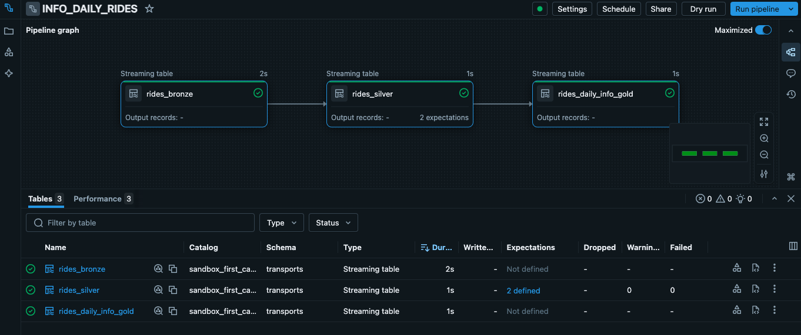
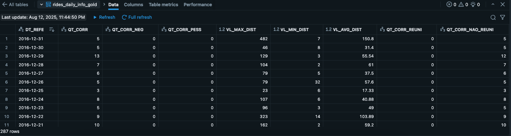

# Assignment 1 - Diário de Bordo

## 📌 Descrição

Este projeto processa dados de corridas de um aplicativo de transporte privado, gerando uma tabela agregada **`rides_daily_info_gold`** com métricas diárias de uso, organizada em camadas seguindo a arquitetura **Medallion (Bronze → Silver → Gold)**.

A solução foi implementada inteiramente no **Databricks** utilizando **Databricks SQL** e **Streaming Tables**, permitindo ingestão contínua em caso de adição de novos arquivos.



## 🚀 Setup no Databricks

1. **Carregar o dataset** para a pasta `/Volumes/sandbox_first_catalog/transports/landing-zone/` no **Unity Catalog**.
2. Criar um **Job** no Databricks e associar o arquivo `job.sql`.
3. Configurar para execução **Streaming**.
4. Monitorar o job pela UI do Databricks.
5. Consultar a tabela final com:

   ```sql
   SELECT * FROM sandbox_first_catalog.transports.rides_daily_info_gold;
   ```


## ⚙️ Camadas do Pipeline

1. **Bronze** — Ingestão dos arquivos CSV da landing zone (DBFS)

   ```sql
   CREATE OR REFRESH STREAMING TABLE sandbox_first_catalog.transports.rides_bronze
   AS SELECT *
   FROM STREAM read_files('/Volumes/sandbox_first_catalog/transports/landing-zone/', ...);
   ```

2. **Silver** — Limpeza, conversão de tipos e aplicação de constraints de qualidade

   ```sql
   CREATE OR REFRESH STREAMING TABLE sandbox_first_catalog.transports.rides_silver (
     CONSTRAINT valid_start_date EXPECT (DATA_INICIO IS NOT NULL),
     CONSTRAINT valid_distance EXPECT (DISTANCIA IS NOT NULL)
   )
   AS SELECT ... FROM STREAM sandbox_first_catalog.transports.rides_bronze;
   ```

3. **Gold** — Agregações e métricas finais por dia como requisitado pelos consumidores

   ```sql
   CREATE OR REFRESH STREAMING TABLE sandbox_first_catalog.transports.rides_daily_info_gold
   AS SELECT DATA_INICIO AS DT_REFE, COUNT(*) AS QT_CORR, ...
   FROM STREAM sandbox_first_catalog.transports.rides_silver
   GROUP BY DT_REFE;
   ```

## 📊 Colunas de Saída (`rides_daily_info_gold`)

| Coluna                   | Descrição                                                 |
| ------------------------ | --------------------------------------------------------- |
| **DT\_REFE**             | Data de referência (`yyyy-MM-dd`)                         |
| **QT\_CORR**             | Quantidade total de corridas                              |
| **QT\_CORR\_NEG**        | Corridas com categoria "Negócio"                          |
| **QT\_CORR\_PESS**       | Corridas com categoria "Pessoal"                          |
| **VL\_MAX\_DIST**        | Maior distância percorrida                                |
| **VL\_MIN\_DIST**        | Menor distância percorrida                                |
| **VL\_AVG\_DIST**        | Média das distâncias                                      |
| **QT\_CORR\_REUNI**      | Corridas com propósito "Reunião"                          |
| **QT\_CORR\_NAO\_REUNI** | Corridas com propósito declarado e diferente de "Reunião" |

## Anexos

**DataFrame Final Disponível no Unity Catalog:**

